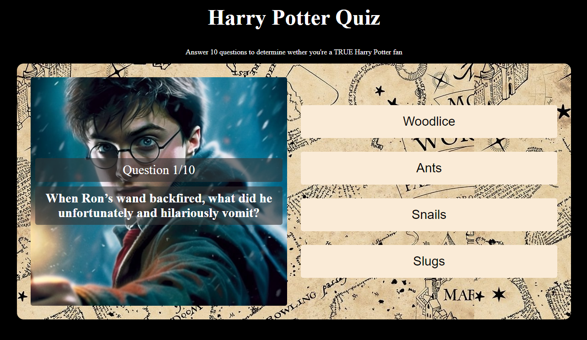

<h3 align="center">Harry Potter Quiz</h3>

<h3 align="center">Personal project for me to enhance my JavaScript skills.</h3>

<h3 align="center">https://ag-harrypotter.web.app/</h3>

## Table Of Contents

- [Table Of Contents](#table-of-contents)
- [About The Project](#about-the-project)
- [Showcase](#showcase)
- [Getting Started](#getting-started)
- [Authors](#authors)

## About the project

Welcome to my "Harry Potter Quiz" project! 🧙‍♂️

This project offers a fun and challenging quiz for Harry Potter fans, testing your knowledge of the magical world created by J.K. Rowling. Utilizing HTML, CSS, and JavaScript, the quiz presents a series of questions with multiple-choice answers, allowing you to dive deep into the lore of Hogwarts and its inhabitants.

**Objective**:

With this project, my aim is to provide an entertaining experience for Harry Potter enthusiasts while also showcasing my skills in frontend development. By combining interactive elements, I hope to engage users and create an immersive quiz environment. It's not just about answering questions correctly; it's about celebrating the magic of Harry Potter and sharing that excitement with fellow fans.

So, whether you're a seasoned wizarding world expert or just dipping your toes into the world of Hogwarts, join me on this enchanting journey through the Harry Potter Quiz!

## Showcase

`/`

## Getting Started

To enjoy the Harry Potter Quiz simply press the link below.

https://ag-harrypotter.web.app/

## Authors

- _Arminas Griesius_ - Front End developer - [Arminas Griesius](https://github.com/ArminasGriesius) - All Work